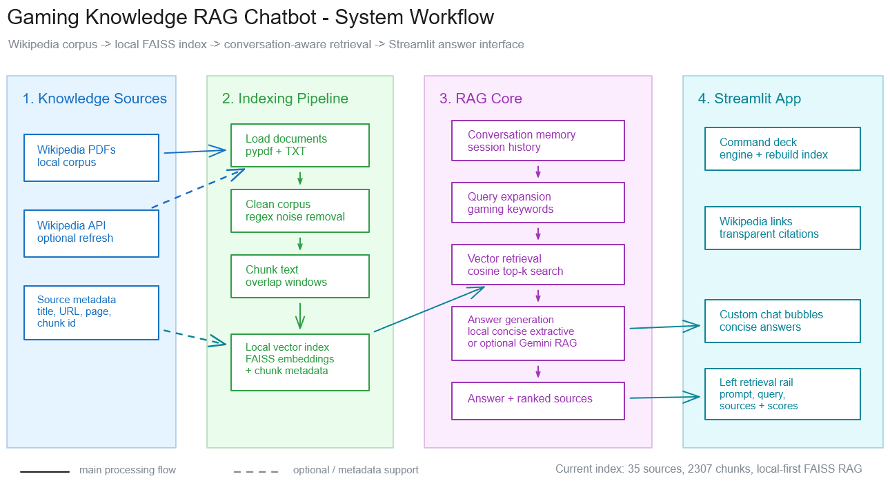

# 🎮 Gaming Knowledge RAG Chatbot

A conversational Retrieval-Augmented Generation (RAG) chatbot for gaming knowledge. It answers questions about gaming history, AAA games, open-world games, genres, cloud gaming, mobile games, and the gaming market using a local Wikipedia-based corpus.

The project is built for an internship submission and a university AI course. The base system runs as a free local retrieval chatbot, while Gemini API mode is optional for LLM-generated answers over the retrieved context.

---

## 🚀 Project Overview

This chatbot combines:

- 📚 A custom Wikipedia gaming corpus
- 🧹 Corpus cleaning and text chunking
- 🔎 Local sentence-transformer embeddings with FAISS similarity search
- 🧠 Conversation memory for follow-up prompts
- 💬 Concise conversational answer formatting
- 🕹️ A custom arcade-style Streamlit interface
- 🧾 A left retrieval feed showing prompt-specific sources, scores, chunks, and links

The main goal is to show how a chatbot can remember conversation context and retrieve external knowledge from a vectorized document store before answering.

---

## 🧭 Project Workflow Diagram



---

## 🧰 Tools and Libraries Used

| Library / Tool | Function in This Project |
|---|---|
| `streamlit` | Builds the desktop-style chatbot interface. Important functions include `st.set_page_config()`, `st.columns()`, `st.chat_input()`, `st.session_state`, `st.button()`, `st.radio()`, `st.checkbox()`, `st.status()`, and custom `st.markdown()` HTML/CSS. |
| `pypdf` | Extracts text from Wikipedia PDF files. `PdfReader` opens each PDF and `page.extract_text()` reads page content. |
| `sentence-transformers` | Loads the free local embedding model. `SentenceTransformer` converts each cleaned chunk and user query into dense semantic vectors. |
| `faiss-cpu` | Stores and searches the local vector index. `IndexFlatIP` ranks normalized embeddings by cosine-style similarity. |
| `numpy` | Converts embedding arrays into `float32` vectors required by FAISS. |
| `requests` | Fetches optional updated article text from the Wikipedia API. |
| `google-genai` | Connects to Gemini API when optional LLM mode is selected. |
| `python-dotenv` | Loads `GEMINI_API_KEY` and `GEMINI_MODEL` from `.env` or `.env.txt`. |
| `json` | Stores chunks, source logs, and index metadata in readable files. |
| `pathlib` | Handles project paths safely across Windows folders. |
| `urllib.parse` | Builds browser-safe Wikipedia source URLs from article titles. |
| `re` | Cleans text, removes citations/noise, splits sentences, extracts keywords, and applies retrieval heuristics. |
| `argparse` | Adds command-line options such as `--refresh-wikipedia`, `--chunk-size`, and `--chunk-overlap` for indexing. |
| `os` | Reads Gemini-related environment variables after `.env` files are loaded. |
| `datetime` and `time` | Create UTC timestamps for metadata/source logs and pause between Wikipedia API requests. |
| `html.escape` | Safely renders user prompts, source titles, scores, and links inside custom Streamlit HTML. |
| `sys` | Uses the current Python executable when Streamlit launches the ingestion script through `subprocess`. |
| `subprocess` | Lets the Streamlit command deck run the ingestion script from inside the app. |

---

## 🧠 Techniques Used

### 1. Retrieval-Augmented Generation (RAG)

The chatbot does not answer from memory alone. It first retrieves relevant chunks from the local Wikipedia corpus, then forms an answer from those retrieved chunks. In Gemini mode, the retrieved chunks are passed as context to the Gemini API.

### 2. Local FAISS Vector Store

The project uses a free local sentence-transformer model instead of paid embedding APIs. Each cleaned text chunk becomes a dense embedding vector, and those vectors are stored locally in a FAISS index.

### 3. Embedding + FAISS Similarity Retrieval

When the user asks a question, the same embedding model converts the query into a vector. FAISS compares the query vector with stored chunk vectors and returns the top-ranked chunks.

### 4. Corpus Cleaning

The cleaning pipeline removes common Wikipedia/PDF noise before indexing:

- Citation markers such as `[12]`
- Reference and external-link sections
- Raw URLs, DOI fragments, ISBN fragments, and category footer text
- Broken PDF line breaks and hyphenated words
- Extra whitespace and punctuation spacing issues

### 5. Overlapping Text Chunking

Long documents are split into manageable chunks with overlap. This keeps context small enough for retrieval while reducing the chance that useful information is cut off between chunks.

### 6. Source Metadata Tracking

Each chunk keeps metadata such as:

- `source_title`
- `source_url`
- `source_kind`
- `page`
- `chunk_index`

This allows the UI to show ranked Wikipedia sources, confidence labels, chunk numbers, and clickable source links.

### 7. Query Expansion

`src/rag_chatbot.py` adds gaming-specific keywords to certain prompts. For example, open-world questions are expanded with terms such as autonomy, freedom, exploration, nonlinear, and sandbox. This improves retrieval for short prompts.

### 8. Conversational Context Memory

The app stores chat history in `st.session_state`. If the user asks a follow-up question using words like "it", "they", "that", or "tell me more", the system combines the latest user question with previous context before retrieval.

### 9. Sentence Scoring and Answer Selection

The local extractive mode scores candidate sentences using keyword overlap, topic-specific boosts, source relevance, and filters for noisy sentences. The final answer is formatted as one concise conversational paragraph.

### 10. Optional Gemini API RAG

Gemini mode still uses retrieval first. The model receives the user question, recent conversation, and retrieved Wikipedia context, then responds in a concise conversational style without bullet points.

### 11. Custom Streamlit UI

The interface is customized beyond a default chatbot:

- Hidden Streamlit chrome
- Arcade neon theme
- Left retrieval rail for the current prompt
- Central chat workspace
- Right command deck for engine selection and index rebuild
- Custom chat bubbles and compact prompt bar
- Source confidence labels and Wikipedia links

---

## ⚙️ How the Code Works

1. `ingest.py` starts the indexing workflow.
2. `src/wiki_fetcher.py` optionally downloads updated Wikipedia text with `--refresh-wikipedia`.
3. `src/document_loader.py` loads PDFs and text files from `data/raw/`, extracts text, and attaches source metadata.
4. `src/text_processing.py` cleans the corpus and creates overlapping text chunks.
5. `src/vector_store.py` builds the FAISS index and saves the embedding config, FAISS index, chunks, and metadata.
6. `app.py` loads the saved index through `LocalVectorStore`.
7. The user asks a question through the Streamlit chat input.
8. `src/rag_chatbot.py` expands the query, uses conversation history when needed, retrieves top chunks, scores sentences, and creates a concise answer.
9. If Gemini mode is selected, `src/llm_client.py` sends the retrieved context to Gemini instead of using the local extractive answer.
10. `app.py` displays the answer, current retrieval query, ranked sources, scores, source links, and retrieved context.

---

## 📁 Project Structure

```text
.
|-- app.py
|-- ingest.py
|-- fetch_wikipedia_sources.py
|-- requirements.txt
|-- run_app.bat
|-- .env.example
|-- data/
|   |-- raw/
|   |   |-- Wikipedia gaming PDFs
|   |   `-- wikipedia_updates/          # optional refreshed text, ignored by Git
|   `-- processed/
|       `-- vector_index/               # generated index files, ignored by Git
`-- src/
    |-- config.py
    |-- document_loader.py
    |-- llm_client.py
    |-- rag_chatbot.py
    |-- text_processing.py
    |-- vector_store.py
    `-- wiki_fetcher.py
```

---

## 📚 Knowledge Base

The corpus uses Wikipedia-only gaming sources, including:

- Gaming
- Video game
- History of video games
- Early history of video games
- AAA games
- Open world
- Video game genres
- Action, action-adventure, racing, horror, sports, RPG, shooter, strategy, puzzle, platformer
- Cloud gaming
- Mobile games
- Video game industry and market-related pages

Current index snapshot:

- Loaded document sections/pages: `429`
- Created text chunks: `2307`
- Indexed source titles: `35`
- Wikipedia source URLs: `35`

---

## ▶️ How to Run

Install dependencies:

```powershell
python -m pip install -r requirements.txt
```

Build the local vector index:

```powershell
python ingest.py
```

Optionally refresh configured Wikipedia text before indexing:

```powershell
python ingest.py --refresh-wikipedia
```

Run the Streamlit app:

```powershell
python -m streamlit run app.py
```

On Windows, you can also run:

```text
run_app.bat
```

---

## 🔐 Optional Gemini Setup

The project works without Gemini in local extractive mode. To enable Gemini API mode, copy the example file:

```powershell
Copy-Item .env.example .env
```

Then add your Gemini settings:

```env
GEMINI_API_KEY=your_gemini_key_here
GEMINI_MODEL=gemini-3.5-flash
```

Secrets are ignored by Git through `.gitignore`.

---

## 💬 Example Questions

- What is gaming?
- How has gaming evolved?
- Why are open-world games popular?
- Why do AAA games sell so much?
- What is the total market of gaming?
- What are the main video game genres?
- What is cloud gaming?
- What are racing video games?
- How are mobile games different from console games?

---

## 📦 Generated Output Files

After indexing, the project creates:

```text
data/processed/vector_index/chunks.json
data/processed/vector_index/faiss.index
data/processed/vector_index/embedding_config.json
data/processed/vector_index/index_metadata.json
data/processed/wikipedia_sources.json
```

---

## ✅ What This Project Demonstrates

- How RAG improves chatbot answers by grounding them in retrieved documents
- How to build a free local semantic retrieval system without paid embedding APIs
- How to clean and chunk a custom PDF/text corpus
- How to persist and reuse a local vector index
- How to add conversational memory with Streamlit session state
- How to show retrieval transparency through source links, scores, and chunks
- How an LLM API can be added on top of retrieval without changing the core index

---

## ⚠️ Limitations

- Local extractive mode is fast and free, but less fluent than a full LLM.
- Gemini mode requires a valid API key.
- Market-size answers are limited to the figures present in the indexed Wikipedia text.
- The first FAISS index build downloads the local embedding model if it is not already cached.
- Wikipedia refresh requests can be rate-limited; skipped pages are logged and the index still builds from available sources.

---

## 🔮 Future Improvements

- Add reranking on top of FAISS retrieval for stronger source selection.
- Add ChromaDB as an optional metadata-rich vector database.
- Add prepared evaluation questions for retrieval and answer quality testing.
- Package the Streamlit app into a desktop-style executable after the RAG workflow is finalized.
